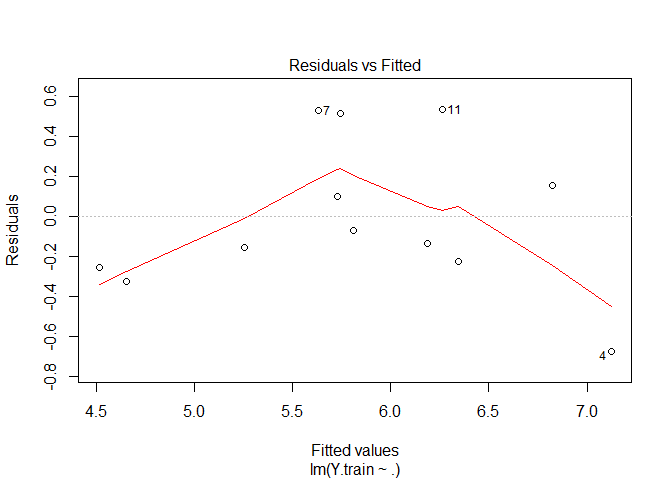
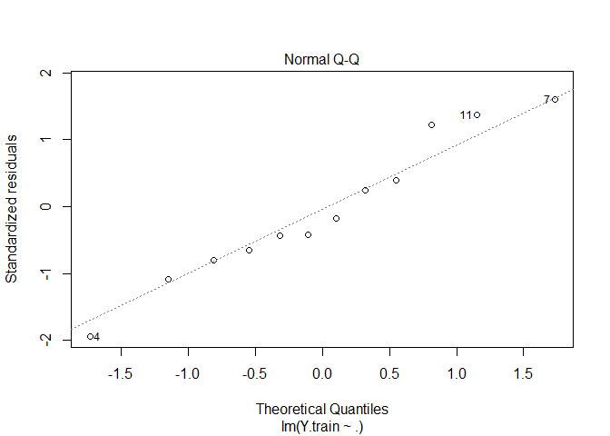
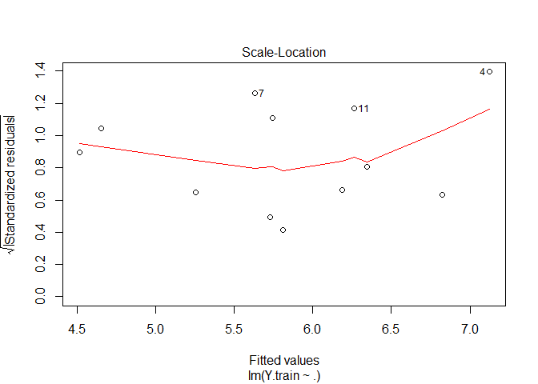
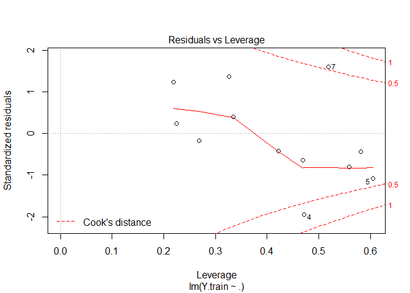
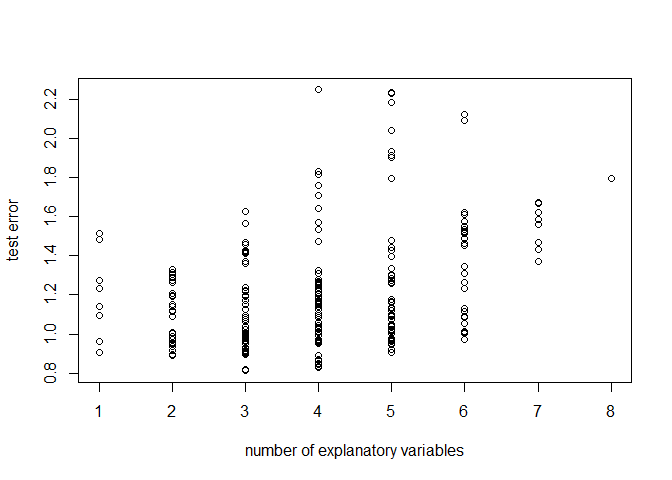
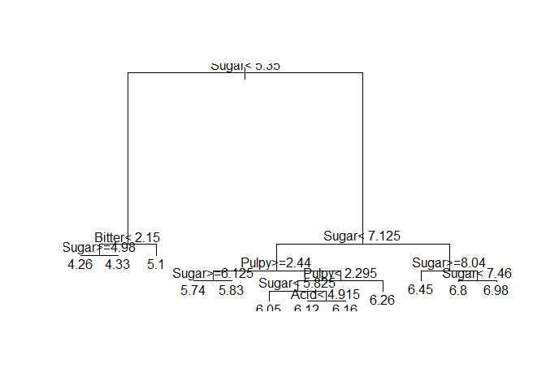
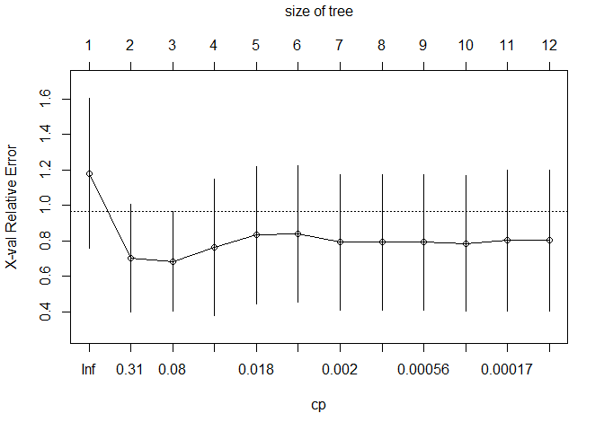
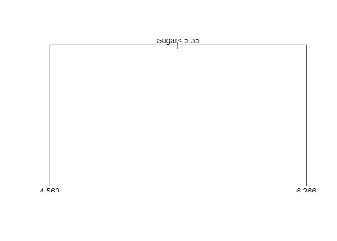

Taste Analysis - multiple methods
================
Andrea Sonnellini
12 settembre 2020

# Scope

In this script I will investigate data2.csv and build several models
that describe the target variable Grade in terms of the given
explanatory variables. Model performances will be assessed via test
errors.

# Preprocessing

``` r
taste = read.table("D:/BIG_DATA/DSTI/OneDrive - Data ScienceTech Institute/2020-06-Advanced_Statistical_Analysis_ML/assignment/data2.csv", sep = ";", dec = ".", header = TRUE)

taste = taste[,-1] # remove product

head(taste)
```

    ##   Sugar Acid Bitter Pulpy Grade
    ## 1  6.21 7.08   2.00  2.54  4.97
    ## 2  7.75 3.29   1.54  2.26  6.98
    ## 3  7.21 4.38   1.79  2.58  4.58
    ## 4  8.33 2.79   1.63  2.71  6.45
    ## 5  4.87 7.71   1.96  1.70  4.33
    ## 6  5.09 7.50   2.13  2.42  4.26

``` r
dim(taste)
```

    ## [1] 16  5

This dataset has only 16 individuals.

# Split training-test

Split dataset in train (75%) and test (25%).

``` r
set.seed(1986)
#number of rows for the train set
row.train.num = floor(dim(taste)[1] * 0.75)
#row.test.num = dim(taste)[1] - row.train.num

#select the specific rows for train
row.train = sample(1:dim(taste)[1], row.train.num, replace = FALSE)

#train set
X.train = taste[row.train, 1:4]
Y.train = taste[row.train, 5]

#test set
X.test = taste[-row.train, 1:4]
Y.test = taste[-row.train, 5]
```

# Training set data exploration

I will check first the peculiarities of the explanatory variables in the
training set.

``` r
cor(X.train)
```

    ##             Sugar       Acid     Bitter      Pulpy
    ## Sugar   1.0000000 -0.9155618 -0.8158345  0.6253435
    ## Acid   -0.9155618  1.0000000  0.8089081 -0.4681178
    ## Bitter -0.8158345  0.8089081  1.0000000 -0.2701406
    ## Pulpy   0.6253435 -0.4681178 -0.2701406  1.0000000

We can see a strong correlation betwee Bitter and Acid and a strong
anti-correlation between Sugar and Acid and Sugar and Bitter. So it
could be interesting to do some variable selection in our models.

In what follows we will build linear regression models, CART and a
Random Forest and select the best one based on their test errors.

# Linear model

I will check first the peculiarities of the full linear model with
respect to the training set.

Adjusted R^2 is very low. Residuals do not look centered, their symmetry
is not exact.

``` r
L = lm(Y.train ~ . , data = X.train)

summary(L)
```

    ## 
    ## Call:
    ## lm(formula = Y.train ~ ., data = X.train)
    ## 
    ## Residuals:
    ##     Min      1Q  Median      3Q     Max 
    ## -0.6730 -0.2323 -0.1027  0.2454  0.5346 
    ## 
    ## Coefficients:
    ##             Estimate Std. Error t value Pr(>|t|)
    ## (Intercept)   2.2747     3.9958   0.569    0.587
    ## Sugar         0.6566     0.4444   1.478    0.183
    ## Acid         -0.3331     0.2262  -1.472    0.184
    ## Bitter        1.6613     1.0663   1.558    0.163
    ## Pulpy        -0.8857     0.7010  -1.264    0.247
    ## 
    ## Residual standard error: 0.476 on 7 degrees of freedom
    ## Multiple R-squared:  0.8096, Adjusted R-squared:  0.7008 
    ## F-statistic: 7.441 on 4 and 7 DF,  p-value: 0.01155

Check assumptions on residuals: it is quite difficult to draw any
conclusion with so few points.

Residuals do not seem centered and show a quadratic trend.

Residuals do not seem to be homoschedastic.

3 points are marked as potential
outliers.

``` r
plot(L)
```

<!-- --><!-- --><!-- --><!-- -->

Shapiro test for normality of the residuals - The shapiro test returns a
p-value such that we do not reject H0, i.e. we cannot reject the fact
that residuals are normal.

``` r
shapiro.test(L$residuals)
```

    ## 
    ##  Shapiro-Wilk normality test
    ## 
    ## data:  L$residuals
    ## W = 0.92549, p-value = 0.3347

Overall the “classic” assumptions on noise do not seem to be fulfilled,
so we cannot use methods which rely on tests of significance to infer
additional insights or perform variable selection.

## Variable selection in linear model

In the following we will perform variable selection based on test error.
Given the quadratic-like trend in the residuals, I will include
quadratic terms in the initial model.

``` r
#include columns for the square of the expl variables
X.train.sq = data.frame(X.train, pul.sq = X.train[,"Pulpy"]^2, Sug.sq = X.train[,"Sugar"]^2, Aci.sq = X.train[,"Acid"]^2, Bit.sq = X.train[,"Bitter"]^2)

X.test.sq = data.frame(X.test, pul.sq = X.test[,"Pulpy"]^2, Sug.sq = X.test[,"Sugar"]^2, Aci.sq = X.test[,"Acid"]^2, Bit.sq = X.test[,"Bitter"]^2)
```

``` r
num.comb = rep(NA,8) # store number of combinations for each value of i

for(i in 1:8){
  
  num.comb[i] = dim(as.matrix(combn(1:8, i)))[2] #number of combinations for a value of i

}

X.full.train = data.frame(X.train.sq,Y.train)

# matrix to save all possible test errors adjusted
store.results = matrix(NA,max(num.comb),8)

test = list() # list to save all possible combinations of i expl variables; i = 1,..,8.
```

``` r
for(i in 1:8){
  #i drives the number of expl variable

  test[[i]] = as.matrix(combn(1:8, i)) # combn returns a matrix where each columns is a possible combination of i expl variables from an initial set of values from 1 to 8
  
  #this for iterates over the columns of test[[i]] which is a matrix as per the previous command
  for(j in 1:dim(test[[i]])[2] ){
    
    df.loop = X.full.train[,c(9,test[[i]][,j])] # dataset considering the j-th combination of i expl variables
    L.loop = lm(Y.train ~ ., data = df.loop) # corresponding model
    
    Y.hat.test = predict(L.loop, newdata = X.test.sq) # prediction on test set
    
    store.results[j,i] =  sqrt(sum((Y.test - Y.hat.test)^2)/ length(Y.test) )# test error
  }
  
}

xval = rep(1:8,each = max(num.comb))
```

The plot below shows the various test errors for each
model

``` r
plot(xval, as.vector(store.results), xlab = 'number of explanatory variables', ylab = 'test error')
```

<!-- -->

It turns out that the linear model with “Acid”, “Pulpy”, “Pulpy.square”
is the one having the smallest error, i.e. 0.812.

``` r
#position of best test error in store.results 
ind.min = which(store.results == store.results[which.min(store.results)], arr.ind=TRUE)

store.results[ind.min] # best test error
```

    ## [1] 0.8118648

``` r
Lfinal.test.err = store.results[ind.min]


best.param = test[[ ind.min[2] ]][,ind.min[1]] #expl var with best r2 adj

best.param
```

    ## [1] 2 4 5

``` r
colnames(X.train.sq[,best.param]) # it turns out that the linear model with "Acid"   "Pulpy"  "pul.sq" is the one having the smallest error
```

    ## [1] "Acid"   "Pulpy"  "pul.sq"

Details of the selected
model:

``` r
Lfinal = lm(Y.train ~ . , data = X.full.train[, c(9, best.param) ]) #selected model

summary(Lfinal) # check all details of selected mode
```

    ## 
    ## Call:
    ## lm(formula = Y.train ~ ., data = X.full.train[, c(9, best.param)])
    ## 
    ## Residuals:
    ##      Min       1Q   Median       3Q      Max 
    ## -0.78893 -0.15248  0.08938  0.14303  0.72649 
    ## 
    ## Coefficients:
    ##             Estimate Std. Error t value Pr(>|t|)   
    ## (Intercept) -2.26913    7.66346  -0.296  0.77470   
    ## Acid        -0.43472    0.09705  -4.479  0.00206 **
    ## Pulpy        9.84469    7.04141   1.398  0.19962   
    ## pul.sq      -2.28760    1.61651  -1.415  0.19475   
    ## ---
    ## Signif. codes:  0 '***' 0.001 '**' 0.01 '*' 0.05 '.' 0.1 ' ' 1
    ## 
    ## Residual standard error: 0.4762 on 8 degrees of freedom
    ## Multiple R-squared:  0.7822, Adjusted R-squared:  0.7005 
    ## F-statistic: 9.576 on 3 and 8 DF,  p-value: 0.005033

# CART

## Build Max Tree

``` r
library(rpart)

Tmax = rpart(Y.train~., data = X.train, control = rpart.control(minsplit = 2, cp = 10^(-9) ))

plot(Tmax)
text(Tmax)
```

<!-- -->

``` r
#check it is max tree -OK
sum(Y.train != predict(Tmax, newdata = X.train))
```

    ## [1] 0

``` r
par.Tmax = printcp(Tmax) 
```

    ## 
    ## Regression tree:
    ## rpart(formula = Y.train ~ ., data = X.train, control = rpart.control(minsplit = 2, 
    ##     cp = 10^(-9)))
    ## 
    ## Variables actually used in tree construction:
    ## [1] Acid   Bitter Pulpy  Sugar 
    ## 
    ## Root node error: 8.3288/12 = 0.69407
    ## 
    ## n= 12 
    ## 
    ##            CP nsplit  rel error  xerror    xstd
    ## 1  7.8277e-01      0 1.0000e+00 1.17966 0.42240
    ## 2  1.2333e-01      1 2.1723e-01 0.70320 0.30138
    ## 3  5.1870e-02      2 9.3899e-02 0.68406 0.27962
    ## 4  2.1036e-02      3 4.2029e-02 0.76536 0.38409
    ## 5  1.5496e-02      4 2.0992e-02 0.83330 0.38679
    ## 6  2.0261e-03      5 5.4960e-03 0.84019 0.38572
    ## 7  1.9451e-03      6 3.4699e-03 0.79320 0.38232
    ## 8  6.4835e-04      7 1.5248e-03 0.79320 0.38232
    ## 9  4.8626e-04      8 8.7648e-04 0.79320 0.38232
    ## 10 2.9416e-04      9 3.9021e-04 0.78569 0.38325
    ## 11 9.6052e-05     10 9.6052e-05 0.80151 0.39781
    ## 12 1.0000e-09     11 0.0000e+00 0.80151 0.39781

``` r
printcp(Tmax) 
```

    ## 
    ## Regression tree:
    ## rpart(formula = Y.train ~ ., data = X.train, control = rpart.control(minsplit = 2, 
    ##     cp = 10^(-9)))
    ## 
    ## Variables actually used in tree construction:
    ## [1] Acid   Bitter Pulpy  Sugar 
    ## 
    ## Root node error: 8.3288/12 = 0.69407
    ## 
    ## n= 12 
    ## 
    ##            CP nsplit  rel error  xerror    xstd
    ## 1  7.8277e-01      0 1.0000e+00 1.17966 0.42240
    ## 2  1.2333e-01      1 2.1723e-01 0.70320 0.30138
    ## 3  5.1870e-02      2 9.3899e-02 0.68406 0.27962
    ## 4  2.1036e-02      3 4.2029e-02 0.76536 0.38409
    ## 5  1.5496e-02      4 2.0992e-02 0.83330 0.38679
    ## 6  2.0261e-03      5 5.4960e-03 0.84019 0.38572
    ## 7  1.9451e-03      6 3.4699e-03 0.79320 0.38232
    ## 8  6.4835e-04      7 1.5248e-03 0.79320 0.38232
    ## 9  4.8626e-04      8 8.7648e-04 0.79320 0.38232
    ## 10 2.9416e-04      9 3.9021e-04 0.78569 0.38325
    ## 11 9.6052e-05     10 9.6052e-05 0.80151 0.39781
    ## 12 1.0000e-09     11 0.0000e+00 0.80151 0.39781

``` r
plotcp(Tmax)
```

<!-- -->

## Prune the tree

We obtain a tree with only the root
node.

``` r
pos.min.xerr = which.min(par.Tmax[,'xerror']) # row number of the tree with minimum xerror

threshold.tree = unique(par.Tmax[pos.min.xerr,"xerror"] + par.Tmax[pos.min.xerr,"xstd"]) #1SE threshold

row.prune = which(par.Tmax[,"xerror"] == par.Tmax[par.Tmax[,"xerror"]< threshold.tree,][,"xerror"][1])

alpha.opt = par.Tmax[row.prune,"CP"]

Tpruned = prune(Tmax, cp = alpha.opt)

plot(Tpruned)
text(Tpruned)
```

<!-- -->

## Test Error for CART

``` r
Y.hat.Cart.test = predict(Tpruned, newdata = X.test)

CART.test.error = sqrt(sum( (Y.test - Y.hat.Cart.test )^2 )/length(Y.test))

CART.test.error
```

    ## [1] 1.212699

# Random Forest

``` r
library(randomForest)
```

    ## randomForest 4.6-14

    ## Type rfNews() to see new features/changes/bug fixes.

``` r
forest = randomForest(Y.train~., data = X.train, ntree = 300)

forest
```

    ## 
    ## Call:
    ##  randomForest(formula = Y.train ~ ., data = X.train, ntree = 300) 
    ##                Type of random forest: regression
    ##                      Number of trees: 300
    ## No. of variables tried at each split: 1
    ## 
    ##           Mean of squared residuals: 0.302326
    ##                     % Var explained: 56.44

``` r
Y.hat.Forest.test = predict(forest, newdata = X.test)

forest.test.error = sqrt(sum( (Y.test - Y.hat.Forest.test )^2 )/length(Y.test))

forest.test.error
```

    ## [1] 1.138351

# Conclusions

From the above procedure we obtained the following test errors for each
model:

  - Linear model with with “Acid” “Pulpy” “pul.sq” ==\> 0.8118648
  - CART ==\> 1.212699
  - Random Forest ==\> 1.14105

Based on the above, the linear model with “Acid” “Pulpy” “pul.sq” is the
model having the lowest test error.

Therefore the linear model has to be considered the best model among the
proposed ones. The final model trained on the full dataset is then:

``` r
enhanced_taste = data.frame(taste, pul.sq = taste[,"Pulpy"]^2)

Lfinal.full = lm(Grade ~ Acid + Pulpy + pul.sq, data = enhanced_taste)

Lfinal.full
```

    ## 
    ## Call:
    ## lm(formula = Grade ~ Acid + Pulpy + pul.sq, data = enhanced_taste)
    ## 
    ## Coefficients:
    ## (Intercept)         Acid        Pulpy       pul.sq  
    ##     -5.5489      -0.4398      13.0579      -3.0718

\[ Grade = -5.5489 -0.4398 * Acid + 13.0579 * Pulpy -3.0718 * Pulpy^2 \]

On the other hand we have to stress that with so few points in the
dataset, we expect the obtained results (in particular the explanatory
variables selected for the linear model) to be quite unstable with
respect to changes in the initial splitting of the dataset in training
and test set. In other words, rerunning the above script with a
different split training-set will most likely lead to different results
for what concerns:

  - the variables selected in the linear model
  - the CART tree nodes/splits

# Possible Improvements

A possible solution to mitigate the instability related to the initial
splitting in training and test set could be to perform model selection
via cross vfold validation. Given the small amount of individuals
probably it could be worth to consider bootstrapped samples.

I did not implement this alternative solution due to the lack of time.
