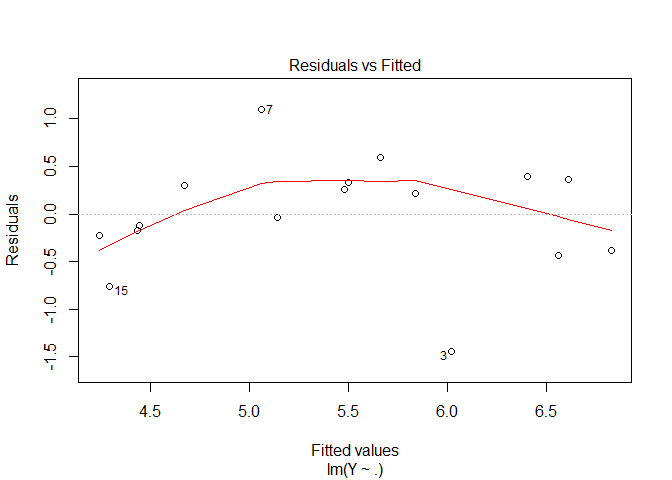
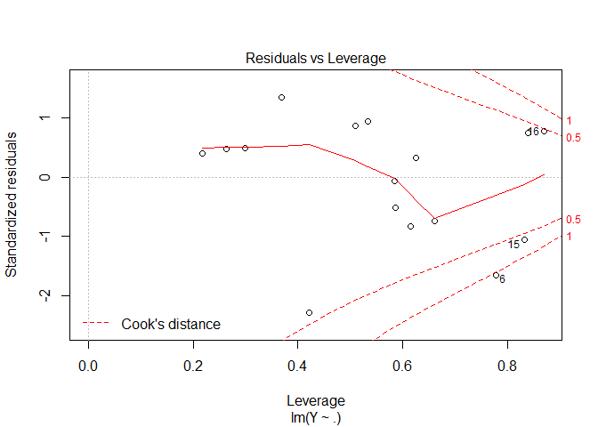
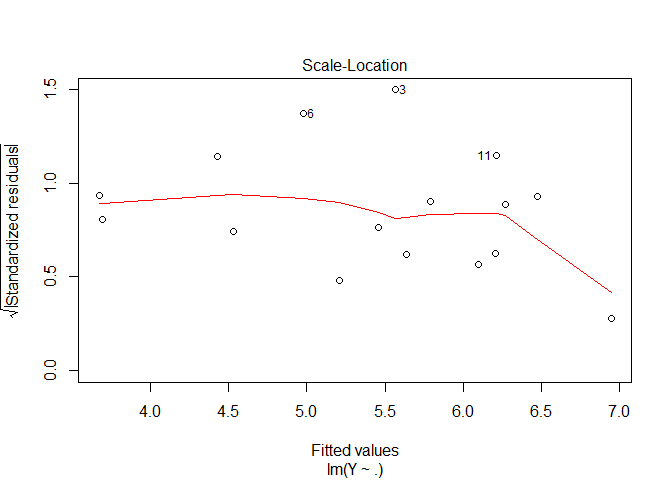
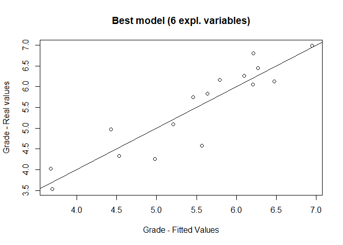

Taste Analysis - Regression Only
================
Andrea Sonnellini
30 agosto 2020

# Scope

In this script I will investigate data2.csv to find the linear model
that best describes the target variable Grade in terms of the given
explanatory variables.

I will focus only on linear models because I consider it as a reference
model that is worth to explore before moving to more complicated models.

An analysis considering also other models will be done in the script
exercise-C2-multiple-methods-assignment-ASML\_v2.

# Preprocessing

``` r
taste = read.table("D:/BIG_DATA/DSTI/OneDrive - Data ScienceTech Institute/2020-06-Advanced_Statistical_Analysis_ML/assignment/data2.csv", sep = ";", dec = ".", header = TRUE)
```

``` r
head(taste)
```

    ##   Product Sugar Acid Bitter Pulpy Grade
    ## 1       1  6.21 7.08   2.00  2.54  4.97
    ## 2       2  7.75 3.29   1.54  2.26  6.98
    ## 3       3  7.21 4.38   1.79  2.58  4.58
    ## 4       4  8.33 2.79   1.63  2.71  6.45
    ## 5       5  4.87 7.71   1.96  1.70  4.33
    ## 6       6  5.09 7.50   2.13  2.42  4.26

``` r
taste = taste[,-1] # remove product

head(taste)
```

    ##   Sugar Acid Bitter Pulpy Grade
    ## 1  6.21 7.08   2.00  2.54  4.97
    ## 2  7.75 3.29   1.54  2.26  6.98
    ## 3  7.21 4.38   1.79  2.58  4.58
    ## 4  8.33 2.79   1.63  2.71  6.45
    ## 5  4.87 7.71   1.96  1.70  4.33
    ## 6  5.09 7.50   2.13  2.42  4.26

Given the name of the columns and the fact that all values are positive
but less than 10, I am under the impression all variables are expressed
on a scale from 1 to 10

``` r
summary(taste) 
```

    ##      Sugar            Acid           Bitter         Pulpy      
    ##  Min.   :4.300   Min.   :2.790   Min.   :1.46   Min.   :1.580  
    ##  1st Qu.:5.035   1st Qu.:4.170   1st Qu.:1.75   1st Qu.:1.805  
    ##  Median :6.085   Median :5.540   Median :2.02   Median :2.295  
    ##  Mean   :6.076   Mean   :5.657   Mean   :1.96   Mean   :2.189  
    ##  3rd Qu.:7.103   3rd Qu.:7.185   3rd Qu.:2.13   3rd Qu.:2.465  
    ##  Max.   :8.330   Max.   :8.330   Max.   :2.48   Max.   :2.710  
    ##      Grade      
    ##  Min.   :3.530  
    ##  1st Qu.:4.518  
    ##  Median :5.785  
    ##  Mean   :5.449  
    ##  3rd Qu.:6.185  
    ##  Max.   :6.980

Values for Sugar and Acid are more spread, while values for Bitter and
Pulpy are within a narrower
range.

``` r
boxplot(taste)
```

<!-- -->

In the below correlation matrix we can see that many observables are
correlated or anti-correlated to each other, in particular we see that:

  - Sugar is much anti-correlated with Acid and Bitter

  - Acid and Bitter are quite correlated

This suggests to explore whether it is possible to build a model that
uses less than the whole set of explanatory variables.

Focusing on the response variable Grade, we see that Grade is quite
strongly anticorrelated with Acid. Nevertheless we should not jump to
any conclusion based on this.

``` r
cor(taste)
```

    ##             Sugar       Acid     Bitter      Pulpy      Grade
    ## Sugar   1.0000000 -0.9129042 -0.8592723  0.7401277  0.7443445
    ## Acid   -0.9129042  1.0000000  0.8585007 -0.5682878 -0.8268553
    ## Bitter -0.8592723  0.8585007  1.0000000 -0.4804826 -0.6909658
    ## Pulpy   0.7401277 -0.5682878 -0.4804826  1.0000000  0.4306060
    ## Grade   0.7443445 -0.8268553 -0.6909658  0.4306060  1.0000000

Below I focus on the relation between Grade and the explanatory
variables taken one by one separately. This comparison can help to have
an idea how Grade depends on the each variables separately, but we
should not jump to any conclusion for the whole model based on that.

The most interesting insight is given by the trend of Grade VS Pulpy,
which seems to show a quadratic behavior, like a reversed parabola.

``` r
X = taste[,-5]
Y = taste$Grade

X.col.name = colnames(X)

for (i in 1:4) plot(X[,i],Y, xlab  = X.col.name[i], ylab = "Grade")
```

<!-- --><!-- --><!-- --><!-- -->

Check rank of the matrix t(X)X

``` r
beta0 = rep(1,dim(X)[[1]])

X.tot = as.matrix(cbind(beta0, X))

eigenXtX = eigen(t(X.tot)%*%X.tot)

eigenXtX$values # all different from zero ==> max rank = 5
```

    ## [1] 1.262067e+03 7.002004e+01 7.355260e-01 4.676449e-01 1.891772e-02

# Standard full linear model

``` r
f = lm(Y ~ ., data = X)

summary(f) # quite low adjusted R^2 and residuals do not look symmetric
```

    ## 
    ## Call:
    ## lm(formula = Y ~ ., data = X)
    ## 
    ## Residuals:
    ##      Min       1Q   Median       3Q      Max 
    ## -1.44199 -0.25923  0.08703  0.33864  1.10096 
    ## 
    ## Coefficients:
    ##             Estimate Std. Error t value Pr(>|t|)  
    ## (Intercept)   7.5091     4.8970   1.533   0.1534  
    ## Sugar         0.1006     0.5589   0.180   0.8605  
    ## Acid         -0.4973     0.2624  -1.895   0.0846 .
    ## Bitter        0.3869     1.3644   0.284   0.7820  
    ## Pulpy        -0.2816     0.8537  -0.330   0.7477  
    ## ---
    ## Signif. codes:  0 '***' 0.001 '**' 0.01 '*' 0.05 '.' 0.1 ' ' 1
    ## 
    ## Residual standard error: 0.6914 on 11 degrees of freedom
    ## Multiple R-squared:  0.6883, Adjusted R-squared:  0.575 
    ## F-statistic: 6.073 on 4 and 11 DF,  p-value: 0.00786

Plotting for the response variable real values VS predicted values we
observe that many points are quite further away from the line
x=y.

``` r
plot(f$fitted.values, Y, xlab = "Grade - fitted values", ylab = "Grade - real values")
abline(0,1)
```

<!-- -->

Checking the assumptions of the noise for this linear regression:

  - Residuals VS fitted values
      - residuals seem not to be centered and homoschedastic.
        Additionally they seem to show a quadratic trend.
    
      - 3 points are highlighted as potential outliers for the
        regression, in particular point3; I will try to re-run the
        regression without considering point 3.
  - QQ-plot: this plot seems not to confirm the normality of the
    standardized
residuals.

<!-- end list -->

``` r
plot(f)
```

<!-- --><!-- --><!-- --><!-- -->

I check gaussianity of the residuals via Shapiro test, even though with
only 16 points it is “easier” not to (wrongly) reject h0.

The test returns p.value \> 0.05 ==\> we cannot reject the fact that
residuals are normally distributed.

``` r
res = f$residuals

shapiro.test(res)
```

    ## 
    ##  Shapiro-Wilk normality test
    ## 
    ## data:  res
    ## W = 0.95598, p-value = 0.5898

The assumption about residuals being homoschedastic and centered seem
not to be fullfilled, so for the remainder of our analysis we cannot use
methods that rely on testing (e.g. Fisher test for variable selection or
computations of confidence intervals for coefficients).

## Rerun the regression without point 3

In terms Adjusted-R-squared there is no improvement.

``` r
# remove line 3
X.no3 = X[-3,]
Y.no3 = Y[-3]

f.no3 = lm(Y.no3~ ., data = X.no3)

summary(f)
```

    ## 
    ## Call:
    ## lm(formula = Y ~ ., data = X)
    ## 
    ## Residuals:
    ##      Min       1Q   Median       3Q      Max 
    ## -1.44199 -0.25923  0.08703  0.33864  1.10096 
    ## 
    ## Coefficients:
    ##             Estimate Std. Error t value Pr(>|t|)  
    ## (Intercept)   7.5091     4.8970   1.533   0.1534  
    ## Sugar         0.1006     0.5589   0.180   0.8605  
    ## Acid         -0.4973     0.2624  -1.895   0.0846 .
    ## Bitter        0.3869     1.3644   0.284   0.7820  
    ## Pulpy        -0.2816     0.8537  -0.330   0.7477  
    ## ---
    ## Signif. codes:  0 '***' 0.001 '**' 0.01 '*' 0.05 '.' 0.1 ' ' 1
    ## 
    ## Residual standard error: 0.6914 on 11 degrees of freedom
    ## Multiple R-squared:  0.6883, Adjusted R-squared:  0.575 
    ## F-statistic: 6.073 on 4 and 11 DF,  p-value: 0.00786

Checking residuals vs fitted values and the QQ plot below, I do not
notice any improvement compared to the case where we considered the full
dataset. So I do not think it is worth to proceed further in the
analysis of the data excluding the outlier number
3.

``` r
plot(f.no3)
```

<!-- --><!-- --><!-- --><!-- -->

# Variable selection from the full original model

Given that:

  - correlation matrix shows some strong correlation/anti-correlation
    among different expl var
  - assumptions on the noise are not fulfilled

I perform variable selection using a comprehensive method +
Adjusted-R-squared as performance metric.

``` r
num.comb = rep(NA,4) # store number of combinations for each value of i

for(i in 1:4){
  
  num.comb[i] = dim(as.matrix(combn(1:4, i)))[2] #number of combinations for a value of i

}
```

Now test all possible lm models with a fixed number of expl. variables.

``` r
X.test = data.frame(X,Y)
```

``` r
# matrix to save all possible Adjusted-R-squared
store.results = matrix(NA,max(num.comb),4)

test = list() # list to save all possible combinations of i expl variables; i = 1,..,10.

for(i in 1:4){
  #i drives the number of expl variable

  test[[i]] = as.matrix(combn(1:4, i)) # combn returns a matrix where each columns is a possible combination of i expl variables from an initial set of values from 1 to 4
  
  #this for iterates over the columns of test[[i]] which is a matrix as per the previous command
  for(j in 1:dim(test[[i]])[2] ){
    
    df.loop = X.test[,c(5,test[[i]][,j])] # dataset considering the j-th combination of i expl variables
    L.loop = lm(Y ~ ., data = df.loop) # corresponding model
    store.results[j,i] =  summary(L.loop)$adj.r.squared # corresponding r2 adj

  }
  
}

xval = rep(1:4,each = max(num.comb))
```

Plot the Adjusted R squared for each
model.

``` r
plot(xval, as.vector(store.results), xlab = "Number of expl. variables", ylab = "Adjusted R squared")
```

<!-- -->

``` r
#Adjusted R-squared foe the Best model 
store.results[which.max(store.results)]
```

    ## [1] 0.6610961

``` r
# expl var of the model
best.1param = test[[1]][,which.max(store.results)]

best.1param
```

    ## [1] 2

``` r
# name of the expl var of the model
colnames(X[best.1param])
```

    ## [1] "Acid"

The selected model has only the explanatory variable Acid and its
Adsjusted R^2 increased from 0.575 to
0.6611.

``` r
L1final = lm(Y ~ . , data = X.test[, c(5, best.1param) ]) #selected model

summary(L1final) # check all details of selected mode
```

    ## 
    ## Call:
    ## lm(formula = Y ~ ., data = X.test[, c(5, best.1param)])
    ## 
    ## Residuals:
    ##      Min       1Q   Median       3Q      Max 
    ## -1.47231 -0.32662  0.09586  0.35103  1.14759 
    ## 
    ## Coefficients:
    ##             Estimate Std. Error t value Pr(>|t|)    
    ## (Intercept)  8.12265    0.51000  15.927 2.30e-10 ***
    ## Acid        -0.47268    0.08593  -5.501 7.81e-05 ***
    ## ---
    ## Signif. codes:  0 '***' 0.001 '**' 0.01 '*' 0.05 '.' 0.1 ' ' 1
    ## 
    ## Residual standard error: 0.6174 on 14 degrees of freedom
    ## Multiple R-squared:  0.6837, Adjusted R-squared:  0.6611 
    ## F-statistic: 30.26 on 1 and 14 DF,  p-value: 7.81e-05

Residuals seem to have the same properties as the full
model.

``` r
plot(L1final)
```

<!-- --><!-- --><!-- --><!-- -->

# Add term Pulpy^2

In the following model I try to add a term equal to Pulpy^2.

``` r
X.pul.sq = data.frame(X, pul.sq = X[,"Pulpy"]^2)
```

Including Pulpy^2 Adjusted-R-squared in the model increase compared to
the full original model from 0.575 to 0.6673.

This is also slightly better than the model with only Acid that had
Adjusted-R-squared equal to 0.6611.

``` r
f.plu.sq = lm(Y~ ., data = X.pul.sq)

summary(f.plu.sq)
```

    ## 
    ## Call:
    ## lm(formula = Y ~ ., data = X.pul.sq)
    ## 
    ## Residuals:
    ##      Min       1Q   Median       3Q      Max 
    ## -1.19315 -0.06477  0.15736  0.30970  0.51412 
    ## 
    ## Coefficients:
    ##             Estimate Std. Error t value Pr(>|t|)  
    ## (Intercept) -11.8435    10.5430  -1.123   0.2875  
    ## Sugar         0.4120     0.5181   0.795   0.4449  
    ## Acid         -0.3810     0.2392  -1.592   0.1424  
    ## Bitter        1.0482     1.2510   0.838   0.4216  
    ## Pulpy        14.8925     7.5742   1.966   0.0776 .
    ## pul.sq       -3.6033     1.7896  -2.013   0.0718 .
    ## ---
    ## Signif. codes:  0 '***' 0.001 '**' 0.01 '*' 0.05 '.' 0.1 ' ' 1
    ## 
    ## Residual standard error: 0.6117 on 10 degrees of freedom
    ## Multiple R-squared:  0.7782, Adjusted R-squared:  0.6673 
    ## F-statistic: 7.018 on 5 and 10 DF,  p-value: 0.004635

Residual Vs Fitted:

  - the trend of the curve changed compared to before but residuals
    still seem not to be centered and not homoschedastic.

  - There are still 3 potential outliers:
    
      - points 3 and 15 were outliers even in the model without Pulpy^2
    
      - point 12 is a “new potential outlier”, while point 7 is not an
        outlier anymore.

  - From QQ plot standardized residuals seem still not to be distributed
    around the the line y=x.

So I believe even in this case assumptions on noise are not
fulfilled.

``` r
plot(f.plu.sq)
```

<!-- --><!-- --><!-- --><!-- -->

Given the improvement in Adjusted-R-squared upon adding a quadratic term
in Pulpy, in what follows I will add a quadratic term for all the expl
variables and then will perform variable selection still based on
Adjusted-R-squared.

# Add quadratic terms to the linear model

``` r
# Add quadratic terms for each expl variable to the dataset
X.sq = data.frame(X, pul.sq = X[,"Pulpy"]^2, Sug.sq = X[,"Sugar"]^2, Aci.sq = X[,"Acid"]^2, Bit.sq = X[,"Bitter"]^2)
```

Adding quadratic terms, the Adjusted R-squared slightly increased up to
0.6814.

Next step is to perform variable selection. To assess what methods we
can use to do variable selection, I will first investigate residuals.
This will let us know whether we can use test-based methods
(e.g. step-by-step Fisher, AIC, BIC ecc) or not.

``` r
f.sq = lm(Y~ ., data = X.sq)

summary(f.sq)
```

    ## 
    ## Call:
    ## lm(formula = Y ~ ., data = X.sq)
    ## 
    ## Residuals:
    ##     Min      1Q  Median      3Q     Max 
    ## -1.0419 -0.2603  0.1459  0.2436  0.6431 
    ## 
    ## Coefficients:
    ##              Estimate Std. Error t value Pr(>|t|)
    ## (Intercept) -46.91638   26.89640  -1.744    0.125
    ## Sugar         1.62788    3.64916   0.446    0.669
    ## Acid         -3.01752    2.98445  -1.011    0.346
    ## Bitter       30.86729   19.91636   1.550    0.165
    ## Pulpy        24.37954   13.88553   1.756    0.123
    ## pul.sq       -5.93515    3.21998  -1.843    0.108
    ## Sug.sq       -0.09952    0.29894  -0.333    0.749
    ## Aci.sq        0.21060    0.23818   0.884    0.406
    ## Bit.sq       -7.33238    4.79736  -1.528    0.170
    ## 
    ## Residual standard error: 0.5986 on 7 degrees of freedom
    ## Multiple R-squared:  0.8513, Adjusted R-squared:  0.6814 
    ## F-statistic:  5.01 on 8 and 7 DF,  p-value: 0.02356

Residuals VS Fitted:

  - residuals look more centered than before. The variance of residuals
    seems to be wider for points having a fitted value \<= 5, so there
    is still no homoschedasticity.

  - QQ plot: points on the right tail are still far from y=x while those
    on the left tails are much closer than before. Some points in the
    central part are still far from
y=x.

<!-- end list -->

``` r
plot(f.sq)
```

<!-- --><!-- --><!-- --><!-- -->

According to shapiro test residuals are gaussian.

``` r
shapiro.test(f.sq$residuals)
```

    ## 
    ##  Shapiro-Wilk normality test
    ## 
    ## data:  f.sq$residuals
    ## W = 0.92947, p-value = 0.2392

Based on the above analysis of residuals, I cannot not use “test-based”
variable selection methods, I will perform variable selection using a
comprehensive method based on Adjusted R-squared.

# Variable selection from the full quadratic model

In what follows we will perfom variable selection based on the
Adjusted-R-squared with a comprehensive approach.

``` r
num.comb = rep(NA,8) # store number of combinations for each value of i

for(i in 1:8){
  
  num.comb[i] = dim(as.matrix(combn(1:8, i)))[2] #number of combinations for a value of i

}
```

Now test all possible lm models with a fixed number of expl. variables.

``` r
X.test = data.frame(X.sq,Y)
```

``` r
# matrix to save all possible R2 adjusted
store.results = matrix(NA,max(num.comb),8)

test = list() # list to save all possible combinations of i expl variables; i = 1,..,10.

for(i in 1:8){
  #i drives the number of expl variable

  test[[i]] = as.matrix(combn(1:8, i)) # combn returns a matrix where each columns is a possible combination of i expl variables from an initial set of values from 1 to 8
  
  #this for iterates over the columns of test[[i]] which is a matrix as per the previous command
  for(j in 1:dim(test[[i]])[2] ){
    
    df.loop = X.test[,c(9,test[[i]][,j])] # dataset considering the j-th combination of i expl variables
    L.loop = lm(Y ~ ., data = df.loop) # corresponding model
    store.results[j,i] =  summary(L.loop)$adj.r.squared # corresponding r2 adj

  }
  
}

xval = rep(1:8,each = max(num.comb))

# plot the Adjusted R^2 for every model 
plot(xval, as.vector(store.results), ylab = "Adjusted R^2", xlab = "Number of variables", title("Var selection on the original model + quadratic terms"))
```

<!-- -->

The best model based on the Adjusted-R-squared selection is the one with
the following variables:

  - Acid

  - Bitter

  - Pulpy

  - pul.sq

  - Aci.sq

  - Bit.sq

<!-- end list -->

``` r
#position of best adjusted-R-squared in store.results 
ind.max = which(store.results == store.results[which.max(store.results)], arr.ind=TRUE)

store.results[ind.max] # max value of r2 adjusted
```

    ## [1] 0.7261738

``` r
best.param = test[[ ind.max[2] ]][,ind.max[1]] #expl var with best r2 adj

best.param
```

    ## [1] 2 3 4 5 7 8

``` r
Lfinal = lm(Y ~ . , data = X.test[, c(9, best.param) ]) #selected model

summary(Lfinal) # check all details of selected mode
```

    ## 
    ## Call:
    ## lm(formula = Y ~ ., data = X.test[, c(9, best.param)])
    ## 
    ## Residuals:
    ##      Min       1Q   Median       3Q      Max 
    ## -0.98482 -0.17455  0.09768  0.29664  0.58577 
    ## 
    ## Coefficients:
    ##             Estimate Std. Error t value Pr(>|t|)  
    ## (Intercept) -42.8217    23.3144  -1.837   0.0994 .
    ## Acid         -2.9364     1.8691  -1.571   0.1506  
    ## Bitter       30.3520    16.7006   1.817   0.1025  
    ## Pulpy        26.7516    12.4170   2.154   0.0596 .
    ## pul.sq       -6.3616     2.9006  -2.193   0.0560 .
    ## Aci.sq        0.1947     0.1522   1.279   0.2328  
    ## Bit.sq       -7.3314     4.0337  -1.818   0.1025  
    ## ---
    ## Signif. codes:  0 '***' 0.001 '**' 0.01 '*' 0.05 '.' 0.1 ' ' 1
    ## 
    ## Residual standard error: 0.555 on 9 degrees of freedom
    ## Multiple R-squared:  0.8357, Adjusted R-squared:  0.7262 
    ## F-statistic:  7.63 on 6 and 9 DF,  p-value: 0.003959

# Check residuals of the selected model

Looking again at residuals vs fitted and the QQ plot, I still do not see
strong evidence about having the hp of the noise being satisfied, in
particular regarding homoschedastic and centered
residuals.

``` r
plot(Lfinal)
```

<!-- --><!-- --><!-- --><!-- -->

``` r
#test gaussianity of the noise - confirms noise is gaussian
shapiro.test(Lfinal$residuals)
```

    ## 
    ##  Shapiro-Wilk normality test
    ## 
    ## data:  Lfinal$residuals
    ## W = 0.93886, p-value = 0.3352

Looking at the graph “Adjusted-R-squared vs number of variables” from
the variable selection, we notice that there is also a model with 3 expl
variables (Pulpy, Pulpy^2, Aci.sq) that performs well, i.e. with an
Adjusted-R-squared equal to 0.718, slightly lower than the best selected
model with 6 explanatory variables that had 0.7262.

Depending on the context and the different needs we may want to choose
one model or another.

``` r
#Adjusted-R-squared for the best model with 3 expl var
store.results[which.max(store.results[,3]),3]
```

    ## [1] 0.7178733

``` r
# 3 expl var of the model
best.3param = test[[3]][,which.max(store.results[,3])]
```

``` r
L3final = lm(Y ~ . , data = X.test[, c(9, best.3param) ]) #selected model

summary(L3final) # check all details of selected mode
```

    ## 
    ## Call:
    ## lm(formula = Y ~ ., data = X.test[, c(9, best.3param)])
    ## 
    ## Residuals:
    ##     Min      1Q  Median      3Q     Max 
    ## -1.2810 -0.2547  0.1674  0.3045  0.7262 
    ## 
    ## Coefficients:
    ##              Estimate Std. Error t value Pr(>|t|)    
    ## (Intercept) -3.657321   7.484056  -0.489 0.633876    
    ## Pulpy       10.392454   6.921134   1.502 0.159061    
    ## pul.sq      -2.478706   1.596870  -1.552 0.146571    
    ## Aci.sq      -0.041437   0.009126  -4.541 0.000677 ***
    ## ---
    ## Signif. codes:  0 '***' 0.001 '**' 0.01 '*' 0.05 '.' 0.1 ' ' 1
    ## 
    ## Residual standard error: 0.5633 on 12 degrees of freedom
    ## Multiple R-squared:  0.7743, Adjusted R-squared:  0.7179 
    ## F-statistic: 13.72 on 3 and 12 DF,  p-value: 0.0003481

Even for this model, from the analysis of the residuals I do not see
enough evidences to infer the hp on the noise are
satisfied.

``` r
plot(L3final)
```

<!-- --><!-- --><!-- --><!-- -->

``` r
# shapiro confirms reasiduals are gaussian
shapiro.test(L3final$residuals)
```

    ## 
    ##  Shapiro-Wilk normality test
    ## 
    ## data:  L3final$residuals
    ## W = 0.91001, p-value = 0.1164

# Conclusions

In this study we assessed the performance of various linear models in
explaining the target variable Grade.

From a preliminary investigation of data we found that some explanatory
variables were correlated or anticorrelated. In light of this we
attempted to perform variable selection.

Among the possible variable selection methods we chose the selection
based on Adjusted-R-squared, below the reasoning we followed:

  - “test-based” methods (e.g. based on Fisher test, AIC, BIC) could not
    be applied because hp on residuals were not fulfilled

  - Lasso: I did not chose Lasso because it has a cross validation step
    to select Lambda and I was concerned that 16 individuals might not
    have been enough to properly perform it

  - cross-validation error: I did not chose this method because I was
    concerned that 16 individuals might not have been enough to properly
    perform it (the split train-test would have led to only 12 points
    for training and 4 for validation); a possible solution could have
    been to generate bootstrapped samples, but I had not time to do it

  - selection based on Adjusted-R-squared: this seemed to me the best
    option because it does not rely on specific assumptions and allows
    to train and assess the model on the whole dataset with no need to
    split the dataset

In light of the above we performed variable selection based on
Adjusted-R-squared considering any possible model built from the
original set of explanatory variables, adding corresponding quadratic
terms. The idea to add quadratic terms came from the qualitative
analysis of residuals for the full model (with original explanatory
variables) which showed a quadratic trend.

Eventually the best model in terms of Adjusted-R-squared turned out to
be (all coefficients are rounded to the second
decimal):

\[ Grade = -42.82 -2.94 * Acid + 30.35 * Bitter + 26.75 * Pulpy -6.36 * Pulpy^2 + 0.20 * Acid^2 -7.33 * Bitter^2 \]

with an Adjusted-R-squared equal to 0.7262.

We report below a plot Real values VS fitted values to give a graphical
representation of the level of “proper fitting” of the model.

We notice that fitted values are closer to real values for Grades (real
values) greater than 5.5, i.e. the model performs better in that range,
while fitted values are further from real values when Grade is less than
5.5.

``` r
plot(Lfinal$fitted.values, taste$Grade, xlab = "Grade - Fitted Values", ylab = "Grade - Real values", title("Best model (6 expl. variables)"))
abline(0,1)
```

<!-- -->

We also report a much simpler model that performed similarly to the best
model in terms of Adjusted-R-squared, namely 0.7179:

\[ Grade = -3.66 + 10.39 * Pulpy -2.48 * Pulpy^2 - 0.04 * Acid^2 \]

Depending on the needs of the entity who requested an analysis of the
data, a much simpler model like the one above might be preferred to a
more complicated ones that performs just slightly
better.

``` r
plot(L3final$fitted.values, taste$Grade, xlab = "Grade - Fitted Values", ylab = "Grade - Real values", title("Simple model"))
abline(0,1)
```

<!-- -->
