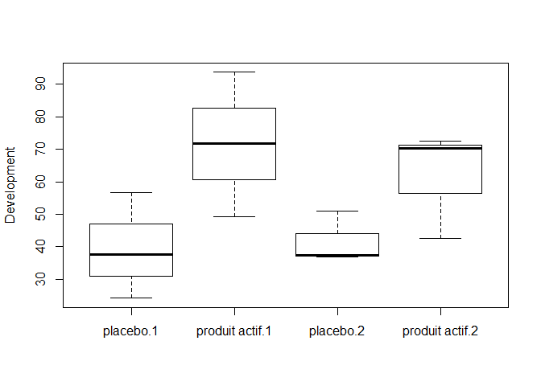
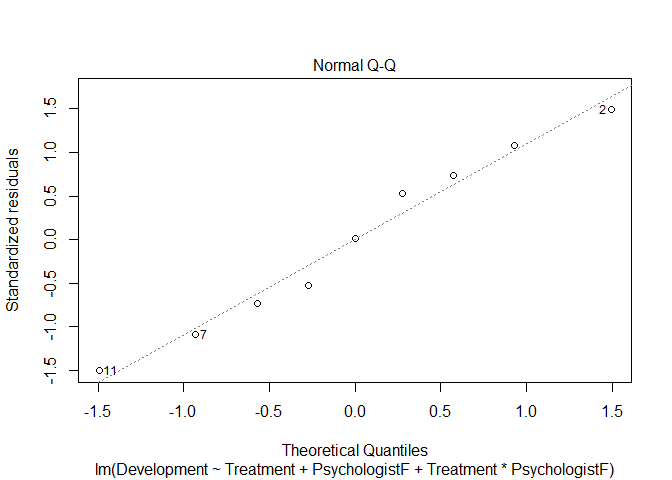

Therapy Analysis
================
Andrea Sonnellini
13 settembre 2020

# Scope

In this script I will investigate data1.csv and build several models
that describe the target variable Development in terms of the given
explanatory variables. Model performances will be assessed via test
errors.

# Data preprocessing

``` r
therapy = read.table("D:/BIG_DATA/DSTI/OneDrive - Data ScienceTech Institute/2020-06-Advanced_Statistical_Analysis_ML/assignment/data1.csv", sep = ";", dec = ".", header = TRUE)

head(therapy)
```

    ##   Children     Treatment Psychologist Development
    ## 1        1       placebo            2        36.8
    ## 2        2 produit actif            1        93.7
    ## 3        3       placebo            1        56.6
    ## 4        4       placebo            1        37.7
    ## 5        5 produit actif            2        70.3
    ## 6        6       placebo            1        24.2

``` r
therapy = therapy[,-1]#remove children

head(therapy)
```

    ##       Treatment Psychologist Development
    ## 1       placebo            2        36.8
    ## 2 produit actif            1        93.7
    ## 3       placebo            1        56.6
    ## 4       placebo            1        37.7
    ## 5 produit actif            2        70.3
    ## 6       placebo            1        24.2

``` r
dim(therapy)
```

    ## [1] 12  3

Ensure both Treatment and Psychologist are considered as
factors

``` r
is.factor(therapy$Treatment) # Treatment is factor - OK
```

    ## [1] TRUE

``` r
is.factor(therapy$Psychologist) # Psychologist is not considered as factor - NOK
```

    ## [1] FALSE

``` r
therapy$PsychologistF = factor(therapy$Psychologist) # convert Psychologist to factor

head(therapy)
```

    ##       Treatment Psychologist Development PsychologistF
    ## 1       placebo            2        36.8             2
    ## 2 produit actif            1        93.7             1
    ## 3       placebo            1        56.6             1
    ## 4       placebo            1        37.7             1
    ## 5 produit actif            2        70.3             2
    ## 6       placebo            1        24.2             1

``` r
is.factor(therapy$PsychologistF)
```

    ## [1] TRUE

``` r
therapy = therapy[,-2]

therapy
```

    ##        Treatment Development PsychologistF
    ## 1        placebo        36.8             2
    ## 2  produit actif        93.7             1
    ## 3        placebo        56.6             1
    ## 4        placebo        37.7             1
    ## 5  produit actif        70.3             2
    ## 6        placebo        24.2             1
    ## 7  produit actif        42.5             2
    ## 8        placebo        50.9             2
    ## 9  produit actif        71.8             1
    ## 10 produit actif        72.5             2
    ## 11 produit actif        49.3             1
    ## 12       placebo        37.3             2

From the below we see that each factor has 2 classes and I think it is
reasonable to assume that Development is expressed on a percentage
scale.

``` r
summary(therapy)
```

    ##          Treatment  Development    PsychologistF
    ##  placebo      :6   Min.   :24.20   1:6          
    ##  produit actif:6   1st Qu.:37.60   2:6          
    ##                    Median :50.10                
    ##                    Mean   :53.63                
    ##                    3rd Qu.:70.67                
    ##                    Max.   :93.70

From the below contingency table we observe that the dataset is well
balanced among all possible combinations of its factors

``` r
table(therapy$Treatment,therapy$PsychologistF)
```

    ##                
    ##                 1 2
    ##   placebo       3 3
    ##   produit actif 3 3

The below boxplot seems to suggest that, regardless the Psychologist,
the Developlment is higher when using the real treatment than when using
the
placebo.

``` r
boxplot(therapy$Development~therapy$Treatment+therapy$PsychologistF, ylab = "Development")
```

<!-- -->

# Split training-test

We would like to select the best model among a linear model (analysis of
variance of 2 factors), CART, based on their test error.

For this reason, we will split the dataset in training (75%) and test
(25%) set.

I am aware that, given the small amount of individuals, any conclusion
we will draw from our analysis may be quite dependent on this split.

``` r
set.seed(1986)

train.row = sample(1: nrow(therapy), floor(nrow(therapy) * 0.75))

therapy.train = therapy[train.row, ]

therapy.test = therapy[-train.row,]
```

I will now check whether therapy.train is balanced in terms of classes
being represented.

Classes of Treatment are balanced, while for PsychologistF there are
more classes 1 than 2.

``` r
table(therapy.train[,-2]) # contingency table for the training set
```

    ##                PsychologistF
    ## Treatment       1 2
    ##   placebo       3 1
    ##   produit actif 3 2

``` r
table(therapy.test[,-2])  # contingency table for the training set
```

    ##                PsychologistF
    ## Treatment       1 2
    ##   placebo       0 2
    ##   produit actif 0 1

To make the training set more balanced, I will swap a randomly chosen
individual from the test set having (treatment = placebo, PsychologistF
= 2) with one element of training having (treatment = placebo,
PsychologistF =
1).

``` r
# random choose individual from the test set having (treatment = placebo, PsychologistF = 2)

#candidate rows to be removed from Test and add it to Train
sub.X.test = therapy.test[(therapy.test[,"Treatment"] == "placebo") & (therapy.test[,"PsychologistF"] == "2"),]

#chose randomly one row from sub.X.test
choise.test.random = sample(1:nrow(sub.X.test),1)

#row to be removed from Test and add it to Train
from.X.test = sub.X.test[choise.test.random,]


#candidate rows to be removed from Train and add it to Test
sub.X.train = therapy.train[(therapy.train[,"Treatment"] == "placebo") & (therapy.train[,"PsychologistF"] == "1"),]

#chose randomly one row from sub.X.train
choise.train.random = sample(1:nrow(sub.X.train),1) 

#row to be removed from Train and add it to Test
from.X.train = sub.X.train[choise.train.random,]

#make the swap
#train - remove from.X.train
therapy.train = subset(therapy.train, rownames(therapy.train) != rownames(from.X.train))

# add from.X.test
therapy.train = rbind(therapy.train, from.X.test )

#check the new trainset - OK
table(therapy.train[,-2])
```

    ##                PsychologistF
    ## Treatment       1 2
    ##   placebo       2 2
    ##   produit actif 3 2

``` r
#test - remove from.X.test
therapy.test = subset(therapy.test, rownames(therapy.test) != rownames(from.X.test))

# add from.X.test
therapy.test = rbind(therapy.test, from.X.train )

table(therapy.test[,-2]) #ok
```

    ##                PsychologistF
    ## Treatment       1 2
    ##   placebo       1 1
    ##   produit actif 0 1

# Linear model

## Overview

Running a full linear model (i.e. additive + cross-effect terms ) we see
from the summary that residual quartiles seem not to be symmetric except
median. Plotting Fitted values vs real values we can also see that the
model poorly fits the
data.

``` r
L = lm(Development ~ Treatment + PsychologistF + Treatment*PsychologistF, data = therapy.train)

summary(L)
```

    ## 
    ## Call:
    ## lm(formula = Development ~ Treatment + PsychologistF + Treatment * 
    ##     PsychologistF, data = therapy.train)
    ## 
    ## Residuals:
    ##      3      7     11      5      8      2      4      9     12 
    ##   9.45 -13.90 -22.30  13.90   6.80  22.10  -9.45   0.20  -6.80 
    ## 
    ## Coefficients:
    ##                                       Estimate Std. Error t value Pr(>|t|)
    ## (Intercept)                              47.15      12.82   3.678   0.0143
    ## Treatmentproduit actif                   24.45      16.55   1.477   0.1996
    ## PsychologistF2                           -3.05      18.13  -0.168   0.8730
    ## Treatmentproduit actif:PsychologistF2   -12.15      24.55  -0.495   0.6416
    ##                                        
    ## (Intercept)                           *
    ## Treatmentproduit actif                 
    ## PsychologistF2                         
    ## Treatmentproduit actif:PsychologistF2  
    ## ---
    ## Signif. codes:  0 '***' 0.001 '**' 0.01 '*' 0.05 '.' 0.1 ' ' 1
    ## 
    ## Residual standard error: 18.13 on 5 degrees of freedom
    ## Multiple R-squared:  0.4151, Adjusted R-squared:  0.06414 
    ## F-statistic: 1.183 on 3 and 5 DF,  p-value: 0.4045

``` r
plot(therapy.train$Development, L$fitted.values, xlab = "Development", ylab = "Fitted Development")
abline(0,1)
```

<!-- -->

## Check residuals

Looking at residuals vs fitted we see that residuals are perfectly
centered and symmetric - this circumstance look quite strange.
Homoschedasticity seems not to be ok, meaning that variance of the noise
increases when the fitted value increases. Also 3 outliers of the linear
model are identified (2,7,11).

Gaussianity: Considering that with few poins fluctuations are more
likely to occur, I think QQ plot looks ok. Also Shapiro Test confirms
the gaussianity of the noise, even though with few points the outcome of
this test is not as reliable as in the case with more individuals
available.

Based on the above we cannot rely on any “test-like” technique to assess
whether both the factors Treatment and PsychologistF are relevant for
the final outcome of
Development.

``` r
plot(L)
```

<!-- --><!-- --><!-- --><!-- -->

``` r
shapiro.test(L$residuals)
```

    ## 
    ##  Shapiro-Wilk normality test
    ## 
    ## data:  L$residuals
    ## W = 0.98298, p-value = 0.9778

## Test Error of the full linear Model

Given that we cannot explore the model via testing-based methods, I will
compute directly the test error for the full linear model.

``` r
Y.hat.reg = predict(L, newdata = therapy.test[,-2])

reg.test.err = sqrt( sum( (therapy.test$Development - Y.hat.reg)^2 ) / length(Y.hat.reg) )

reg.test.err
```

    ## [1] 16.72526

## Alternative Linear models

I will compute also the test error for “simpler” linear models, namely
models with:

1)  Treatment
2)  PsychologistF
3)  Treatment\*PsychologistF
4)  Treatment + Treatment\*PsychologistF
5)  PsychologistF + Treatment\*PsychologistF
6)  PsychologistF + Treatment

<!-- end list -->

``` r
L1 = lm(Development ~ Treatment, data = therapy.train)
L2 = lm(Development ~ PsychologistF, data = therapy.train)
L3 = lm(Development ~ Treatment*PsychologistF, data = therapy.train)
L4 = lm(Development ~ Treatment + Treatment*PsychologistF, data = therapy.train)
L5 = lm(Development ~ PsychologistF + Treatment*PsychologistF, data = therapy.train)
L6 = lm(Development ~ PsychologistF + Treatment, data = therapy.train)

reduced.model = list(L1,L2,L3,L4,L5,L6)

reduced.model.test.err = matrix(NA, 6,1)

for ( i in 1:6){
  
  Y.hat.reduced.model = predict(reduced.model[[i]], newdata = therapy.test)
  
  reduced.model.test.err[i] = sqrt( sum( (therapy.test$Development - Y.hat.reduced.model )^2  ) / length(Y.hat.reduced.model)  )
}

reduced.model.test.err
```

    ##          [,1]
    ## [1,] 13.97178
    ## [2,] 26.40221
    ## [3,] 16.72526
    ## [4,] 16.72526
    ## [5,] 16.72526
    ## [6,] 17.02117

## Selected linear model

The best linear model is then L1, i.e. the model built considering only
the variable Treatment.

``` r
reg.test.err = reduced.model.test.err[1]
```

# Cart considering both Treatment and PsychologistF

## Maximum tree

Given that some of the individuals have the same value for Treatment and
PsychologistF but different values for the response variable, of course
cart will never have a training error equal to 0 because each leaf will
have more than one individual, each of them having a different value for
Development. The tree will then associate to that leaf the mean value of
the response variable of the elements within that leaf, leading to a
non-zero training error.

So I do not know if Tmax below can be considered the maximum tree.

Also, given the few points available (9), I reduced the number of cross
validation folds from 10 to 4.

``` r
library(rpart)

Tmax = rpart(Development~ ., data = therapy.train, control = rpart.control(minsplit = 2, cp = 10^(-12), xval = 4) )

plot(Tmax)
text(Tmax)
```

<!-- -->

``` r
Tmax
```

    ## n= 9 
    ## 
    ## node), split, n, deviance, yval
    ##       * denotes terminal node
    ## 
    ## 1) root 9 2809.3760 56.67778  
    ##   2) Treatment=placebo 4  280.3875 45.62500  
    ##     4) PsychologistF=2 2   92.4800 44.10000 *
    ##     5) PsychologistF=1 2  178.6050 47.15000 *
    ##   3) Treatment=produit actif 5 1649.4080 65.52000  
    ##     6) PsychologistF=2 2  386.4200 56.40000 *
    ##     7) PsychologistF=1 3  985.7400 71.60000 *

``` r
#check it is max tree - NOK
sum( (therapy.train$Development - predict(Tmax, newdata = therapy.train))^2 ) /length(therapy.train$Development)
```

    ## [1] 182.5828

``` r
printcp(Tmax)
```

    ## 
    ## Regression tree:
    ## rpart(formula = Development ~ ., data = therapy.train, control = rpart.control(minsplit = 2, 
    ##     cp = 10^(-12), xval = 4))
    ## 
    ## Variables actually used in tree construction:
    ## [1] PsychologistF Treatment    
    ## 
    ## Root node error: 2809.4/9 = 312.15
    ## 
    ## n= 9 
    ## 
    ##           CP nsplit rel error xerror    xstd
    ## 1 3.1309e-01      0   1.00000 1.1137 0.52691
    ## 2 9.8687e-02      1   0.68691 1.4349 0.40984
    ## 3 3.3112e-03      2   0.58823 1.2338 0.28852
    ## 4 1.0000e-12      3   0.58491 1.2871 0.26439

## Prune the tree

Looking at the cross validation error, it turns out that the best tree
is the one with no splits, i.e. one unique leaf that always predicts in
output the same value (average of values of the dependent variable it
was trained on) for any input.

``` r
plotcp(Tmax)
```

<!-- -->

Prune the tree at its root level - as explained this leads to a tree
that has 1 leaf that gives out the same output for any input, namely the
average value of the target variable of the individuals it was trained
on

``` r
Tpruned = prune(Tmax, cp = 3.1309e-01)

# for any individual the tree returns the average value of the target variable of the individuals it was trained on
mean(therapy.train$Development) == predict(Tpruned, newdata = therapy.test[,-2])
```

    ## [1] TRUE TRUE TRUE

We can compute then the test error

``` r
y.hat.cart = predict(Tpruned, newdata = therapy.test[,-2])

cart.test.err = sqrt( sum( (therapy.test$Development -  y.hat.cart)^2)/ length(y.hat.cart)   )

cart.test.err
```

    ## [1] 23.80669

I believe this dataset is particularly difficult to be processed by cart
because there are both:

  - very few individuals

  - the combinations Treatment-PsychologistF value of the explanatory
    variables are few and values of the response variable within the
    same Treatment-PsychologistF are quite different

For example in our training set we observe the following values for
Develpment depending on the couples (Treatment PsychologistF):

  - (placebo, 1) ==\> 56.6, 37.7

  - (placebo, 2) ==\> 50.9, 37.3

  - (acrif, 1) ==\> 49.3, 93.7, 71.8

  - (actif, 2) ==\> 42.5, 70.3

So, apart from the point having 93.7, the range of values of Development
across different categories is quite homogeneous (between 37 and 70),
but within the same leaf each individual has a different Development
value.

We can try to perform cart considering only one explanatory variable at
time, and then compute its test error.

``` r
therapy.train[
  with(therapy.train, order(Treatment, PsychologistF)),
]
```

    ##        Treatment Development PsychologistF
    ## 3        placebo        56.6             1
    ## 4        placebo        37.7             1
    ## 8        placebo        50.9             2
    ## 12       placebo        37.3             2
    ## 11 produit actif        49.3             1
    ## 2  produit actif        93.7             1
    ## 9  produit actif        71.8             1
    ## 7  produit actif        42.5             2
    ## 5  produit actif        70.3             2

# Cart with only Treatment

``` r
Tmax.treat = rpart(Development~ Treatment, data = therapy.train, control = rpart.control(minsplit = 2, cp = 10^(-12), xval = 4) )

plot(Tmax.treat)
text(Tmax.treat)
```

<!-- -->

``` r
Tmax.treat
```

    ## n= 9 
    ## 
    ## node), split, n, deviance, yval
    ##       * denotes terminal node
    ## 
    ## 1) root 9 2809.3760 56.67778  
    ##   2) Treatment=placebo 4  280.3875 45.62500 *
    ##   3) Treatment=produit actif 5 1649.4080 65.52000 *

``` r
#check it is max tree - NOK
sum( (therapy.train$Development - predict(Tmax.treat, newdata = therapy.train))^2 ) / length(therapy.train$Development)
```

    ## [1] 214.4217

``` r
printcp(Tmax.treat)
```

    ## 
    ## Regression tree:
    ## rpart(formula = Development ~ Treatment, data = therapy.train, 
    ##     control = rpart.control(minsplit = 2, cp = 10^(-12), xval = 4))
    ## 
    ## Variables actually used in tree construction:
    ## [1] Treatment
    ## 
    ## Root node error: 2809.4/9 = 312.15
    ## 
    ## n= 9 
    ## 
    ##           CP nsplit rel error xerror    xstd
    ## 1 3.1309e-01      0   1.00000 1.3076 0.55215
    ## 2 1.0000e-12      1   0.68691 1.3036 0.50551

``` r
plotcp(Tmax.treat)
```

<!-- -->

Even in this case we get the same result as for the case where we had
both Treatment and PsychologistF, ie a tree with only 1 leaf.
Performance are then the
same.

# Cart with only PsychologistF

``` r
Tmax.psyc = rpart(Development~ PsychologistF, data = therapy.train, control = rpart.control(minsplit = 2, cp = 10^(-12), xval = 4) )

plot(Tmax.psyc)
text(Tmax.psyc)
```

<!-- -->

``` r
Tmax.psyc
```

    ## n= 9 
    ## 
    ## node), split, n, deviance, yval
    ##       * denotes terminal node
    ## 
    ## 1) root 9 2809.376 56.67778  
    ##   2) PsychologistF=2 4  630.190 50.25000 *
    ##   3) PsychologistF=1 5 1881.708 61.82000 *

``` r
#check it is max tree - NOK
sum( (therapy.train$Development - predict(Tmax.psyc, newdata = therapy.train))^2 ) / length(therapy.train$Development)
```

    ## [1] 279.0998

``` r
printcp(Tmax.psyc)
```

    ## 
    ## Regression tree:
    ## rpart(formula = Development ~ PsychologistF, data = therapy.train, 
    ##     control = rpart.control(minsplit = 2, cp = 10^(-12), xval = 4))
    ## 
    ## Variables actually used in tree construction:
    ## [1] PsychologistF
    ## 
    ## Root node error: 2809.4/9 = 312.15
    ## 
    ## n= 9 
    ## 
    ##           CP nsplit rel error xerror    xstd
    ## 1 1.0589e-01      0   1.00000 1.6331 0.61331
    ## 2 1.0000e-12      1   0.89411 1.8106 0.65736

``` r
plotcp(Tmax.psyc)
```

<!-- -->

Same result as before.

# Conclusions

From the above analysis it turns out that linear model with 1 factor and
Cart Tree:

``` r
reg.test.err
```

    ## [1] 13.97178

``` r
cart.test.err
```

    ## [1] 23.80669

Based on the above the best model is the linear model with 1 factor
Treatment.

Now that the final model has been selected, we have to train it on the
full dataset - that will be the final model to be used in future:

``` r
L1 = lm(Development ~ Treatment, data = therapy)
L1
```

    ## 
    ## Call:
    ## lm(formula = Development ~ Treatment, data = therapy)
    ## 
    ## Coefficients:
    ##            (Intercept)  Treatmentproduit actif  
    ##                  40.58                   26.10

The below graph shows its predictions on the full
dataset:

``` r
plot(as.numeric(therapy$Treatment), therapy$Development,ylim = c(0,100), ylab = "Development", xaxt="n", xlim = c(0,3), xlab="", title(main = "Linear Model - 1 factor (Treatment)"))
axis(1, at=1:2, labels=c("placebo","produit actif"))
par(new = TRUE)
plot(as.numeric(therapy$Treatment), predict(L1, newdata = therapy),ylim = c(0,100), ylab ="" , xaxt="n", xlim = c(0,3), xlab = "", col = "red", pch = 5)
legend("topright", legend = c("True value", "Predicted"), col=c("black","red"), pch = c(1,5))
```

<!-- -->

We remark that, considering that the dataset has very few individuals,
results we found may be very sensitive to the initial splitting in train
and test set. In other words, a different intial splitting of the
dataset may lead to different test errors, and then to the choice of a
different model.

During my investigation we also faced difficulties with cart tree. I
think this is mainly due to:

  - few individuals in the training set

  - the combinations Treatment-PsychologistF value of the explanatory
    variables are few and values of the response variable within the
    same Treatment-PsychologistF couple are quite different - this
    prevented us from constructing a maximal tree

An alternative approach could be to turn our problem from a regression
one to a classification one, aggregating the various values of
Development in classes, for example Low, Medium and High. Of course this
alternative approach should be validated first with some expert to
understand if the corresponding insights could still be of interest or
not.

I did not try to run Random Forest because even though I understood
their basic working principle, I was not sure it would have been correct
to use them with a training set of only 9 individuals.
